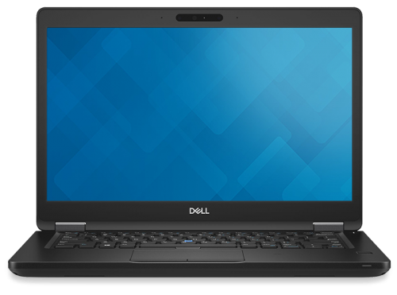

# Dell Latitude 5491
- Catalina 10.15.7 with Clover r5120

## Disclaimer
- There is no hardware warranty for changing the BIOS in this guide.
- There is no software warranty in this guide. (OS and data loss, recovery partition loss, etc.)
- This guide is not suitable for all beginners who want to hackintosh.

## Product information

- [Product detail](https://www.dell.com/lt/business/p/latitude-14-5491-laptop/pd)
- Intel i7-8850H
- Intel AC9560
- Intel I219-LM
- Three USB3 port, one USB-C/TB3 port
- M.2 2280 SATA 6G Hynix SSD 256GB

## MacOS and bootloader prepare
- [Download OSX](https://support.apple.com/ko-kr/HT211683)
- [Clover r5120](https://github.com/CloverHackyColor/CloverBootloader/releases/tag/5120)
- [CFG Lock disable](https://github.com/jaromeyer/XPS9570-Catalina/issues/44) not working..
### Latitude 5491 CFG Lock Offset (just note)
> ... Unicode text "CFG Lock" in Setup/PE32 image section at header-offset 7EB9Ch ...

> ... 0x4CBC6 		One Of: CFG Lock, VarStoreInfo (VarOffset/VarName): **0x5BD**,...

Latitude 5491 CFG Lock hashcode is **0x58D**. However, **this does not reflect the change.** (I tried working on it first, but this change doesn't get reflected. Is there a better way?)

## Kexts
- [IO80211Family w. Airportitlwm](https://github.com/win1010525/Airportitlwm-kext); Factory built-in Intel AC9560 Wifi (no use heliport)
- [IntelBluetoothFirmware](https://github.com/OpenIntelWireless/IntelBluetoothFirmware);  Factory built-in Intel AC9560 Bluetooth
- [VoodooI2CHID 2.6](https://github.com/VoodooI2C/VoodooI2C); TouchPad
- Lilu, WhateverGreen
- CPUFriend for i7-8850H with data provider setting
- AppleALC
- NoTouchID
- VirtualSMC; SMCBatteryManager, SMCProcessor, SMCSuperIO
- USBInjectAll, XHCI-unsupported

## Working 
- SpeedStep
- Wireless LAN (WiFi)
- Bluetooth
- LAN
- TouchPad
- Speaker / MIC
- Audio jack (Headphone / MIC)
- Graphic acceleration
- Charging to USB-C/TB3/AC
- Battery infomation

## Not working
- HDMI
- AirDrop
- SD card reader
- **Fan sensor detection**
> There is a performance problem because the fan cannot be controlled. For example, when you need more CPU power, there is no FAN sensor, so there is an increase in wind speed with temperature, but the CPU power consumption does not. On the contrary, when idle, the fan speed is very high, even just because the CPU temperature is high.

## Step-by-step
1. Clone this repository
2. **IMPORTANT** Go to the SMBIOS tab of the Clover bootloader and complete all the serials.
3. Copy the MacOS image to the USB and install Clover. And it overwrites the EFI of this repository.
4. Proceed with installation.
5. Profit!